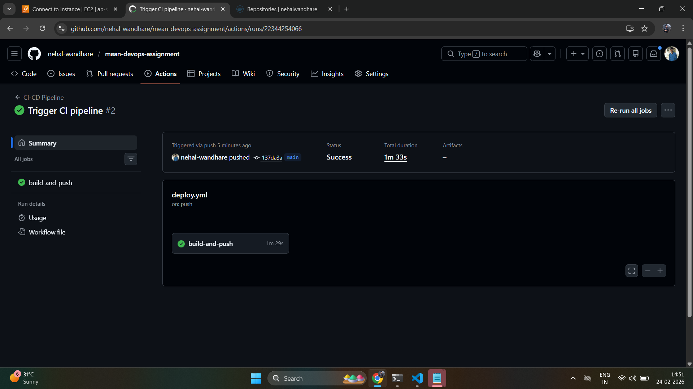
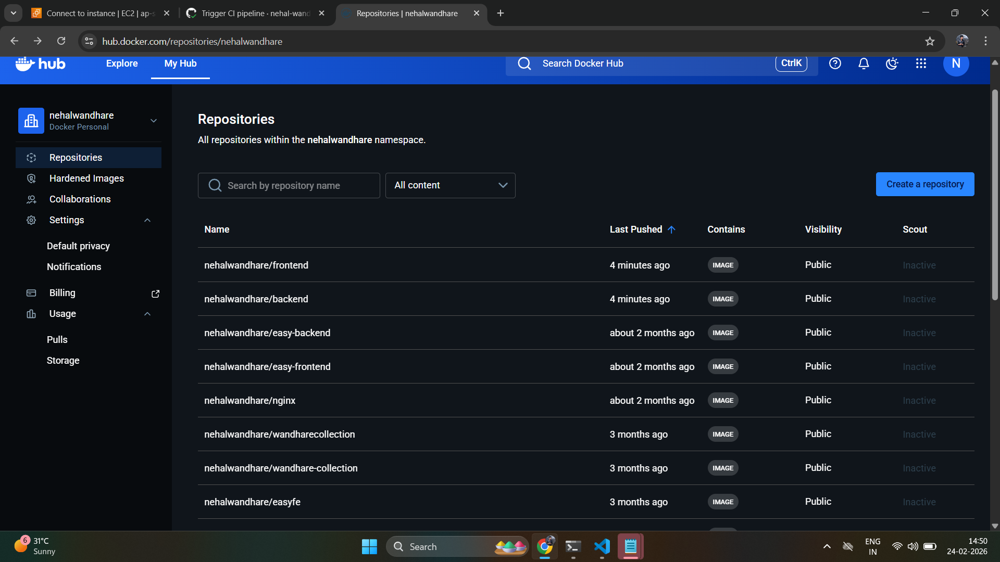
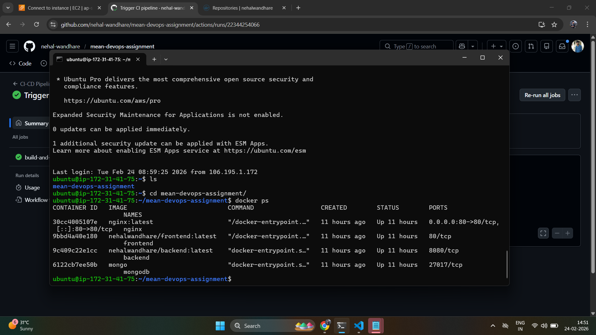
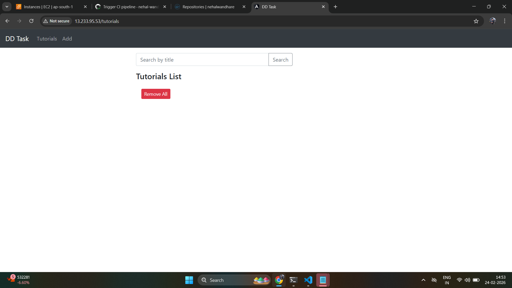
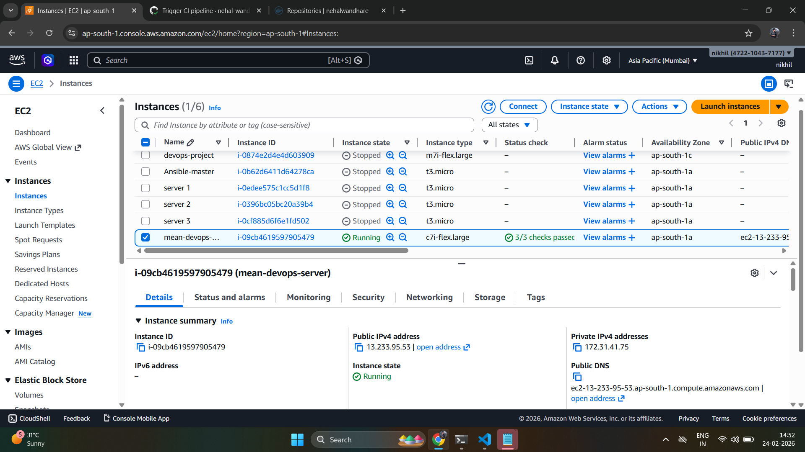

# 🚀 MEAN Stack CRUD Application – DevOps Deployment

## 📖 Project Overview
This project demonstrates the deployment of a full-stack MEAN (MongoDB, Express, Angular 15, Node.js) application using Docker, Docker Compose, Nginx Reverse Proxy, and CI/CD pipeline with GitHub Actions.

The application allows users to:
- Create tutorials
- Retrieve tutorials
- Update tutorials
- Delete tutorials
- Search tutorials by title

---

## 🏗 Architecture

User  
↓  
Nginx (Port 80 - Reverse Proxy)  
↓  
Frontend (Angular - Docker Container)  
↓  
Backend (Node.js + Express - Docker Container)  
↓  
MongoDB (Official Docker Image)

CI/CD Flow:  
GitHub → GitHub Actions → Docker Hub → EC2 (Ubuntu)

---

## 🐳 Dockerization

### Backend
- Base Image: Node 18
- Exposed Port: 8080
- REST APIs for CRUD operations

### Frontend
- Built using Angular 15
- Production build served via Nginx
- Exposed internally on port 80

### MongoDB
- Official `mongo` Docker image
- Persistent volume configured

---

## 🌐 Nginx Reverse Proxy

Nginx routes traffic:
- `/` → Frontend
- `/api` → Backend

Application accessible via:

```
http://<EC2_PUBLIC_IP>
```

---

## 🔁 CI/CD Pipeline (GitHub Actions)

Pipeline triggers on every push to `main` branch.

### Steps:
1. Checkout code
2. Login to Docker Hub
3. Build backend image
4. Build frontend image
5. Push images to Docker Hub

Images stored at:
- Docker Hub: `nehalwandhare/backend`
- Docker Hub: `nehalwandhare/frontend`

---

## ☁️ Cloud Deployment

- Platform: AWS EC2 (Ubuntu 24.04)
- Docker & Docker Compose installed

Deployment command:

```
docker-compose up -d
```

---

---

# 📸 Screenshots

## 1️⃣ CI/CD Pipeline Success


---

## 2️⃣ Docker Hub Images


---

## 3️⃣ Running Containers on EC2


---

## 4️⃣ Application Running in Browser


---

---

##  AWS EC2 Instance Running


## 👨‍💻 Author

Nehal Wandhare  
DevOps Internship Assignment – 2026
